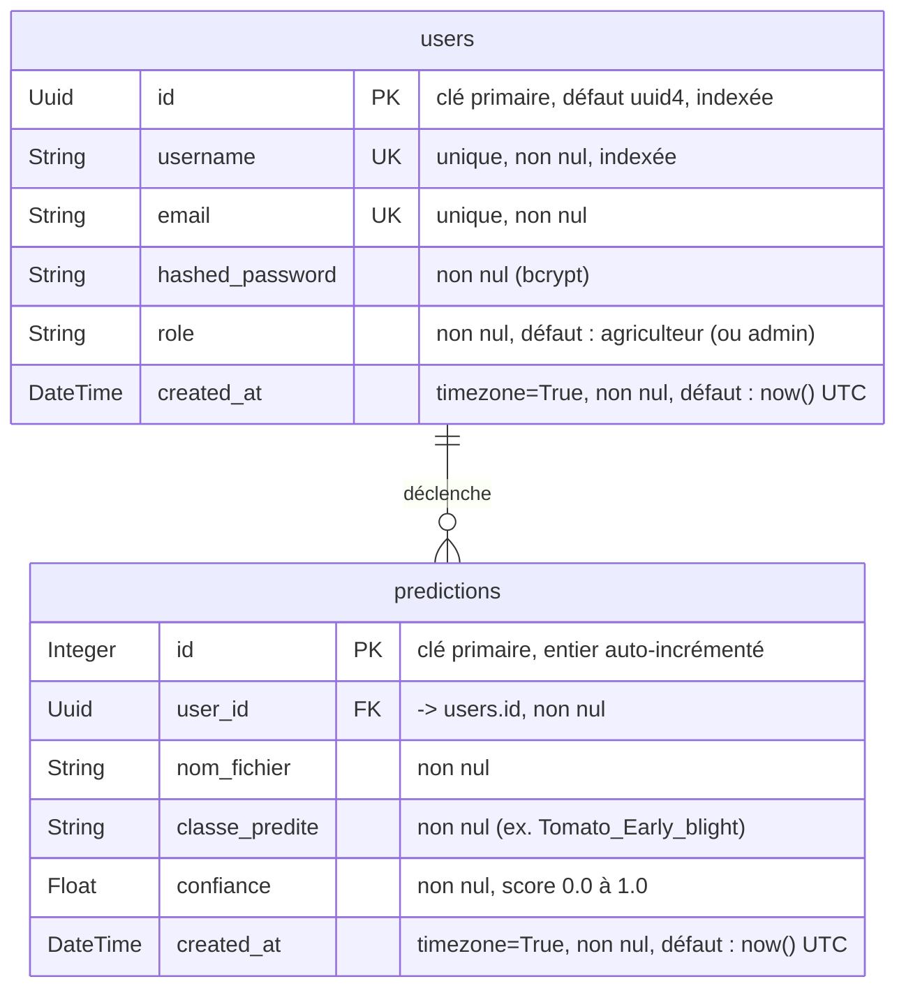
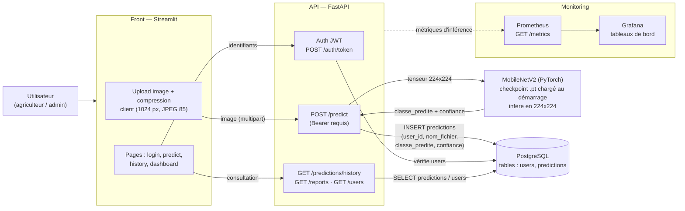
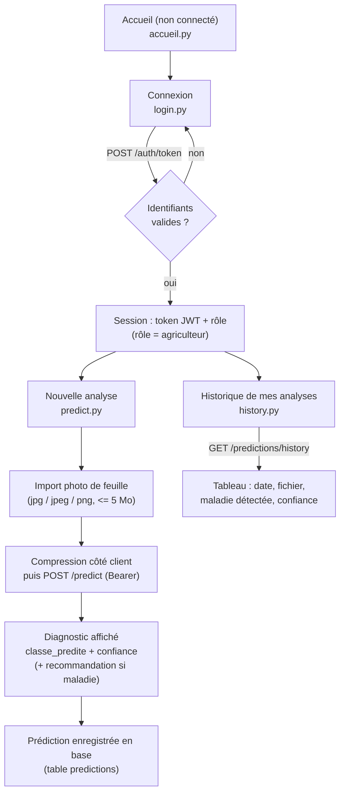
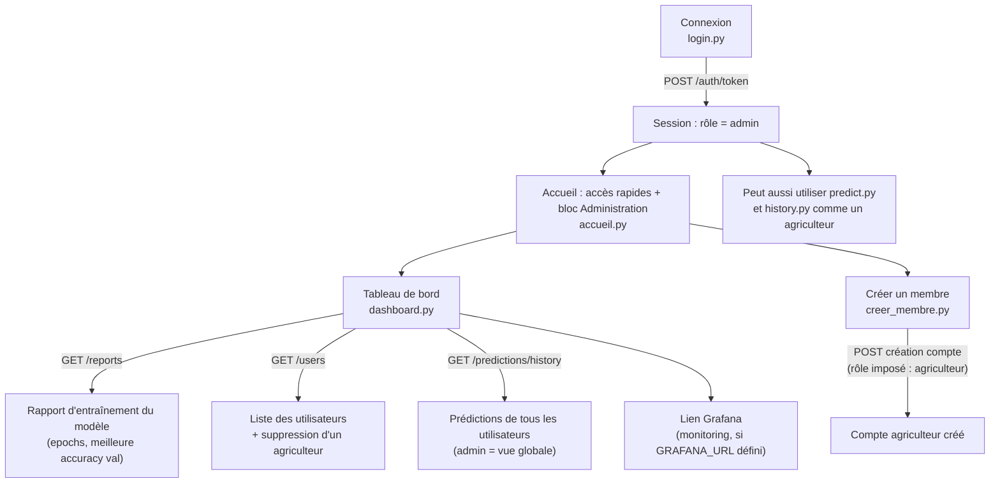

# Modélisation — TomatoScan (C14 / C15)

> **Ce fichier est la source de vérité de la modélisation.**
> Il est écrit en Markdown + diagrammes **Mermaid** : éditable, *diffable* et
> versionné avec le code. Il fait foi sur toute autre représentation.
>
> Les PDF de conception issus des issues **#26 / #27**
> (`docs/specs_fonctionnelles.pdf`, `docs/specs_techniques.pdf`,
> `docs/modelisation.pdf`) sont des exports binaires **non éditables** qui ont
> **divergé du code réel**. Ils doivent être **régénérés depuis cette source**.
> Éléments obsolètes qu'ils contiennent encore et qui n'existent pas dans le
> système réel :
>
> | Élément du PDF (obsolète) | Réalité du code |
> |---|---|
> | Entité `MODEL` dans le MCD | **Aucune table modèle** — le modèle est un fichier `.pt` chargé en mémoire au démarrage (voir note sous le MCD) |
> | TensorFlow / fichier `.keras` | **PyTorch** — checkpoint `models/mobilenetv2_best_*.pt` |
> | MLflow (suivi d'expériences) | **Pas de MLflow** — rapports d'entraînement/évaluation en JSON/CSV versionnés dans `docs/` |
> | Colonnes `disease_class` / `confidence_score` | Colonnes réelles **`classe_predite`** / **`confiance`** |
>
> **Preuves (fichiers réels du dépôt) :** schéma de base de données
> `src/tomatoscan/database/modeles.py` ; chargement du modèle
> `src/tomatoscan/api/services/model_service.py` ; entraînement PyTorch
> `src/tomatoscan/model/train.py`.

---

## 1. Modèle conceptuel de données (MCD / entités-relations)

Reflète **exactement** les deux tables déclarées dans
`src/tomatoscan/database/modeles.py` (classes SQLAlchemy `User` → table
`users`, `Prediction` → table `predictions`). Noms de colonnes et types
Python/SQLAlchemy repris tels quels.

**Cardinalité** : un `users` possède 0..N `predictions` ; chaque `predictions`
appartient à exactement un `users` (relation SQLAlchemy `User.predictions` ↔
`Prediction.utilisateur`, FK `predictions.user_id`).

> **Note — pas d'entité `MODEL` en base.** Le modèle de classification n'est
> **pas** une table. C'est un **checkpoint PyTorch** (`.pt`) —
> `models/mobilenetv2_best_20260624_161841.pt` par défaut, surchargé par la
> variable d'environnement `MODEL_PATH` — chargé **une seule fois au démarrage**
> de l'API (singleton `initialiser_modele()` dans
> `src/tomatoscan/api/services/model_service.py`). Le checkpoint embarque les
> poids (`model_state_dict`) et la liste des classes (`class_names`, 10 classes
> tomate). Il n'est donc ni stocké ni versionné en base de données. De même, les
> **images ne sont pas persistées** : seul le **nom du fichier** (`nom_fichier`)
> est conservé, pas l'image elle-même.

---

## 2. Diagramme de flux de données

Chaîne réelle : navigateur → **Streamlit** (front) → **FastAPI** (API) →
**MobileNetV2 (PyTorch)** → **PostgreSQL**, avec **Prometheus + Grafana** pour le
monitoring. Les libellés de données utilisent les **vrais** noms de colonnes
(`classe_predite`, `confiance`).

> **Note — pas de MLflow.** Aucun suivi d'expériences MLflow n'est branché. Les
> métriques d'inférence en production sont exposées par l'API sur `GET /metrics`
> au format Prometheus (`src/tomatoscan/api/metrics.py`) :
> `tomatoscan_predictions_total`, `tomatoscan_prediction_duration_seconds`,
> `tomatoscan_prediction_confidence`, `tomatoscan_errors_total`. Les rapports
> d'entraînement / évaluation sont des artefacts **JSON / CSV versionnés** dans
> `docs/` (ex. `docs/rapport_evaluation_20260624_163236.json`), pas des runs
> MLflow.

---

## 3. Parcours utilisateurs

Cohérents avec les pages réelles de `src/tomatoscan/front/pages/`
(`accueil.py`, `login.py`, `predict.py`, `history.py`, `dashboard.py`,
`creer_membre.py`).

### 3.1 Agriculteur

### 3.2 Administrateur

---

## 4. Standard d'accessibilité visé

Le front vise la conformité **WCAG 2.1 niveau AA**. Concrètement, côté code :
contrastes texte/fond calculés par formule de luminance relative WCAG (bandeaux
résultat : blanc sur `#2d6a4f` = 6.39:1 et blanc sur `#c1121f` = 6.22:1, tous
deux ≥ 4.5:1 requis en AA), textes alternatifs sur les aperçus d'image, icônes
décoratives marquées `aria-hidden`, et structure de pages navigable au clavier
(voir `src/tomatoscan/front/pages/predict.py` et `history.py`).

---

*Document éditable — toute évolution du schéma
(`src/tomatoscan/database/modeles.py`) ou des pages front doit être répercutée
ici, puis les PDF de conception régénérés depuis cette source.*
