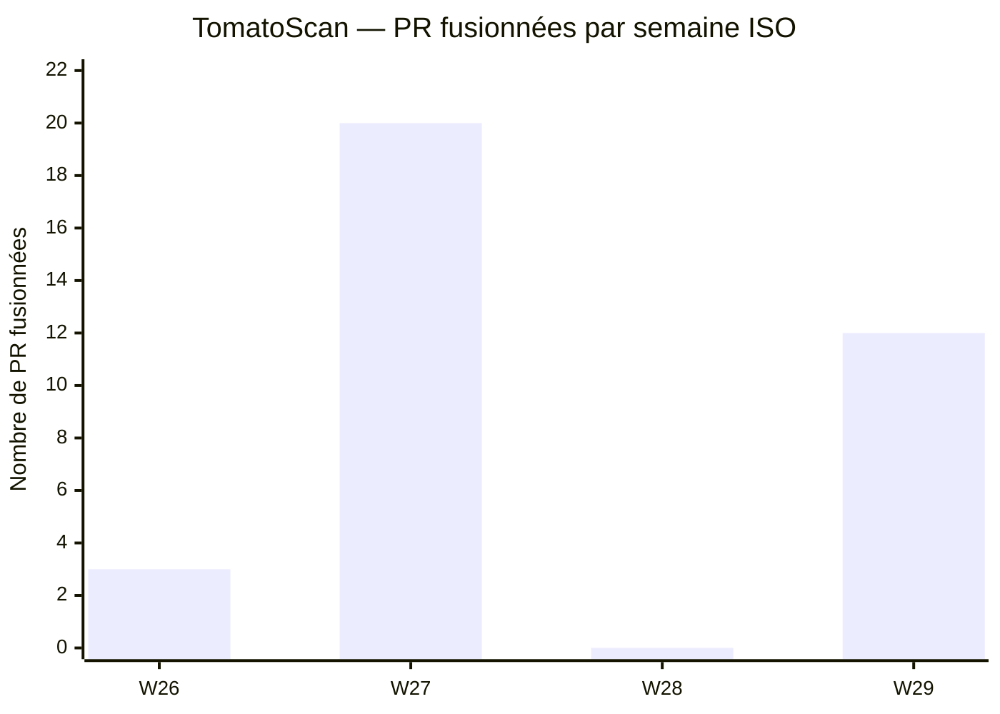
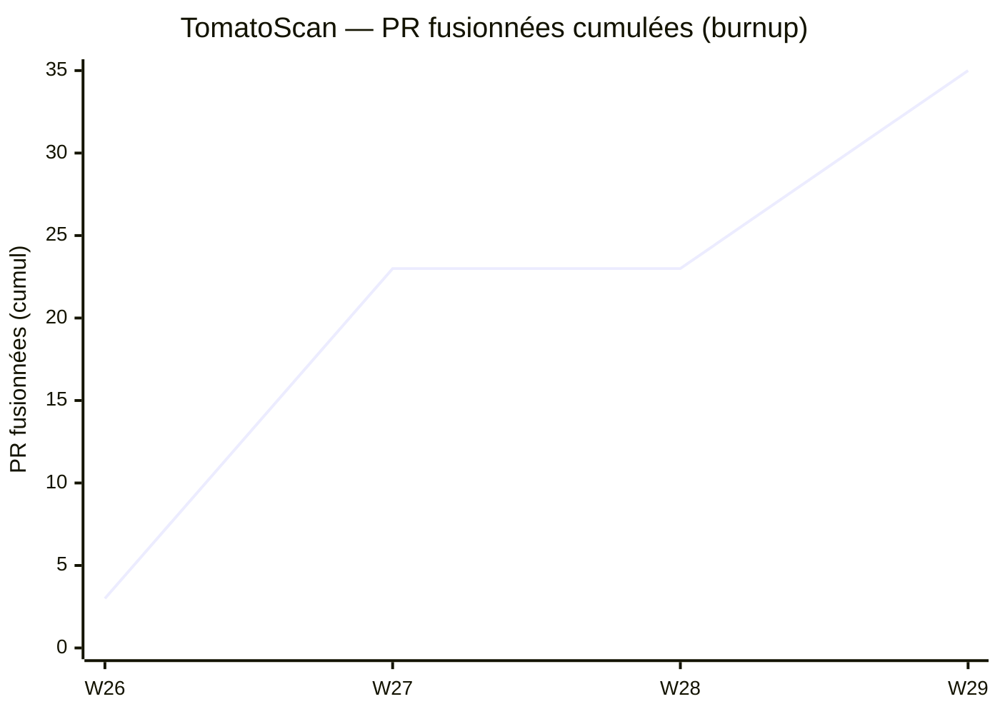

# Cadence de livraison — suivi réel généré depuis Git

> **Nature de ce document.** Il s'agit d'un artefact de suivi **entièrement dérivé de
> l'historique Git réel** du dépôt (Pull Requests fusionnées et leurs dates). Il sert de
> **substitut honnête au burndown chart** : un projet de certification individuel sans
> découpage en sprints ni estimation en points d'histoire ne peut pas produire un
> burndown SCRUM authentique (voir [docs/agile.md](agile.md#burndown-chart)). Ce que Git
> prouve, en revanche, c'est un **rythme de fusion de lots de travail dans le temps** —
> c'est ce que ce document mesure, et rien de plus.
>
> Aucun chiffre ci-dessous n'est inventé : tout provient des commandes Git reproduites
> dans la section [Méthode de génération](#méthode-de-génération).

## Sommaire

1. [Méthode de génération](#méthode-de-génération)
2. [Cadence par semaine (tableau)](#cadence-par-semaine-tableau)
3. [Graphique — PR fusionnées par semaine](#graphique--pr-fusionnées-par-semaine)
4. [Graphique — avancement cumulé (burnup)](#graphique--avancement-cumulé-burnup)
5. [Analyse de la cadence](#analyse-de-la-cadence)

## Méthode de génération

Les données sont extraites du dépôt avec les commandes suivantes (reproductibles) :

```bash
# Liste des PR fusionnées avec leur date (ordre chronologique)
git log --merges --date=short --pretty="%ad %s"

# Nombre total de merges
git log --merges --oneline | wc -l          # -> 35

# Regroupement par semaine ISO
git log --merges --date=format:'%G-W%V' --pretty="%ad" | sort | uniq -c
```

Résultat brut du regroupement par semaine ISO au 2026-07-20 :

```
   3 2026-W26
  20 2026-W27
  12 2026-W29
```

**Total : 35 commits de merge.** Sur ces 35, **34 sont des PR de fonctionnalité ou de
correctif fusionnées sur `develop`**, et **1 est la promotion initiale `develop → main`**
(PR #42, 2026-06-23, seul merge présent sur la branche `main` — vérifié par
`git log --merges --oneline main | wc -l` qui retourne `1`). La semaine ISO 2026-W28
(06/07 → 12/07) n'apparaît pas dans le regroupement car **aucune PR n'y a été fusionnée** ;
elle est réintroduite explicitement à 0 dans les tableaux et graphiques ci-dessous pour
ne pas masquer ce creux.

## Cadence par semaine (tableau)

| Semaine ISO | Période (lun. → dim.) | PR fusionnées | Cumul | Thèmes dominants (d'après les vrais messages de commit) |
|---|---|---:|---:|---|
| 2026-W26 | 22/06 → 28/06 | 3 | 3 | Amorce : entraînement modèle MobileNetV2 (#30), setup FastAPI + `/health` (#4), promotion initiale `develop → main` (#42) |
| 2026-W27 | 29/06 → 05/07 | 20 | 23 | **Pic** : socle API complet (`/predict` #5, auth JWT #6, OWASP #7, BDD PostgreSQL #31, `/reports` #9, OpenAPI #8), frontend Streamlit (#11/#12/#13), historique (#32), tests + couverture (#10), CI (#37), CD/Docker (#39), monitoring Prometheus/Grafana (#15/#16), correctifs de déploiement (torch CPU, réseau Coolify, ruff) |
| 2026-W28 | 06/07 → 12/07 | 0 | 23 | **Creux de fusion** : aucune PR fusionnée. Période consacrée à la rédaction des specs / documents de modélisation (les branches `25-docs-*`, `26-docs-*`, `27-docs-*` sont travaillées ici puis fusionnées en W29) |
| 2026-W29 | 13/07 → 19/07 | 12 | 35 | Reprise : développement frontend avancé (#82), gestion des rôles admin/agriculteur (correctifs JWT #84/#87), bonnes pratiques API (#88), migration PostgreSQL asynchrone (#89), déclencheur de réentraînement C11 (#90), correctif healthcheck (#92), corrections de code audit E3/E4 (#94), documentation (#95) et fusion des livrables de docs (#43/#44/#45) |

Détail journalier réel (`git log --merges --date=short --pretty="%ad" | sort | uniq -c`) :

```
   1 2026-06-23      1 2026-07-13
   1 2026-06-24      3 2026-07-14
   1 2026-06-25      1 2026-07-15
   6 2026-06-29      2 2026-07-16
   6 2026-07-01      5 2026-07-19
   8 2026-07-02
```

## Graphique — PR fusionnées par semaine



## Graphique — avancement cumulé (burnup)

Vue « burnup » : nombre total de PR fusionnées accumulées semaine après semaine. C'est la
lecture la plus proche d'un suivi d'avancement honnête à partir de Git — une courbe qui
monte à mesure que le travail est livré, sans prétendre à des points d'histoire jamais posés.



## Analyse de la cadence

La cadence réelle fait apparaître **trois phases nettes**, cohérentes avec le contenu des
messages de commit :

- **Amorce (W26, 3 PR).** Mise en place des deux fondations minimales : le modèle de
  classification (entraînement MobileNetV2, #30) et le squelette de l'API (FastAPI +
  endpoint `/health`, #4). Rythme volontairement bas : on pose les bases avant d'accélérer.

- **Pic de production (W27, 20 PR).** La semaine la plus dense du projet, et de loin :
  elle concentre à elle seule **57 % des PR fusionnées** (20 sur 35). Le socle applicatif
  complet y est livré en petits lots successifs — API métier (prédiction, authentification,
  sécurité OWASP, persistance PostgreSQL, reporting), frontend Streamlit, suite de tests,
  chaîne CI/CD, puis monitoring. On note aussi dans cette semaine une grappe de correctifs
  de déploiement rapprochés (torch CPU pour le build Docker, réseau Coolify, formatage
  ruff), typiques d'une première confrontation à l'environnement de production réel.

- **Creux assumé (W28, 0 PR).** Aucune fusion de code. Ce n'est pas un abandon : la
  période est consacrée à la **rédaction des documents de modélisation et de
  spécifications** (user stories, MCD Merise, specs techniques), matérialisée par les
  branches `25-docs-*`, `26-docs-*`, `27-docs-*` travaillées à ce moment et fusionnées la
  semaine suivante. Le creux dans la cadence de *code* correspond donc à un pic d'activité
  de *documentation* non visible dans les merges.

- **Reprise et durcissement (W29, 12 PR).** Second temps fort, orienté robustesse plutôt
  que nouvelles fonctionnalités : gestion fine des rôles (admin/agriculteur) avec deux
  correctifs successifs sur le décodage JWT, migration vers PostgreSQL asynchrone, ajout du
  déclencheur de réentraînement du modèle (C11), correctif de healthcheck, puis les
  corrections de code issues de l'audit E3/E4 et la fusion des livrables de documentation.

**Lecture d'ensemble.** La distribution est fortement asymétrique (un pic unique en W27,
un creux total en W28) plutôt qu'un débit régulier. C'est le profil attendu d'un projet
individuel piloté par lots thématiques : on construit le socle en bloc, on documente en
bloc, on durcit en bloc. Le rythme reflète des **priorités séquentielles assumées**, pas
une vélocité constante — ce qui est cohérent avec l'absence de sprints à durée fixe
documentée dans [docs/agile.md](agile.md).

---

*Accessibilité : document Markdown structuré (H1→H2), données présentées à la fois en
tableau à en-têtes et en graphiques Mermaid ; l'information chiffrée n'est jamais portée
uniquement par un graphique (chaque valeur figure aussi dans le tableau et le texte).
Rendu, contraste et navigation clavier délégués à la plateforme d'hébergement (GitHub).*
